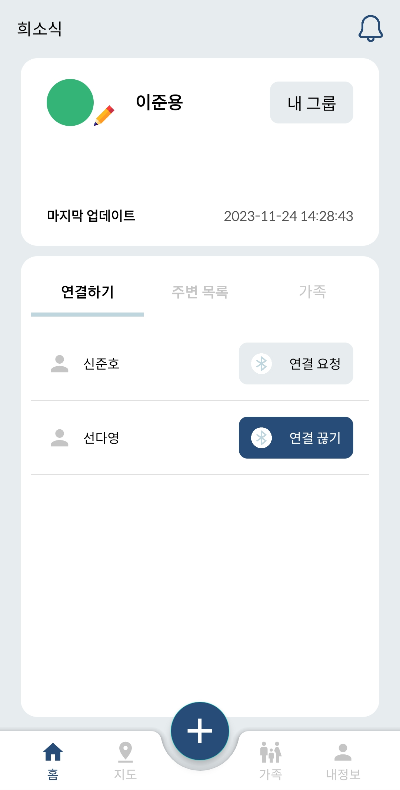
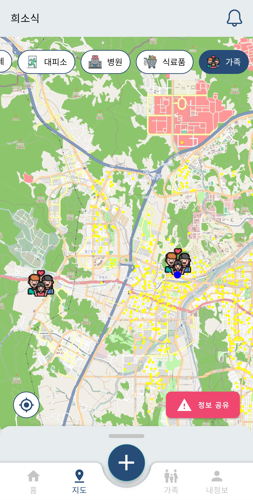

<div align="center">
  
</div>

<br/>

<div align="center">
  <h1>희소식</h1> 
  
<h4> 지진,전쟁과 같은 재난 상황에서 통신이 끊겼을 경우 ,</h4>

<h4> 가족들과 연락 또는 주변 사람들에게 문자를 보내서 도움을 받고 싶을 때,</h4>

<h4> 모스부호나 구조요청를 통해 구조 도움을 받고 싶을 때,</h4>

<h4> 저희는 이와 같은 상황을 위해 “희소식” 서비스를 고안했습니다.</h4>

</div>

<br>

## 👪 개발 멤버 소개

<table> <tr> 
<td height="140px" align="center"> <a href="https://github.com/rileyleee">  <br><br> 👑 이은경 <br>(BackEnd)<br/> </a> <br></td>  
<td height="140px" align="center"> <a href="https://github.com/kimnayeon16">  <br><br> 😶 김나연 <br>(FrontEnd) </a> <br></td> 
<td height="140px" align="center"> <a href="https://github.com/Kim-Yejinn">  <br><br> 🙄 김예진 <br>(BackEnd)<br/> </a> <br></td> 
<td height="140px" align="center"> <a href="https://github.com/seondy">  <br><br> 😆 선다영 <br>(FrontEnd) </a> <br></td>
<td height="140px" align="center"> <a href="https://github.com/sseq007">  <br><br> 😠신준호 <br>(BackEnd) </a> <br></td> 
<td height="140px" align="center"> <a href="https://github.com/elle6044">  <br><br> 🙂 이준용 <br>(BackEnd) </a> <br></td> </tr> 
</table>

<br />

## 📆 프로젝트 기간

### 23.10.09. ~ 23.11.17

<br />

## 🗂️ 프로젝트 구성

<details>
<summary>APP 폴더 구조</summary>

```Plain Text

📦GoodNews
 ┣ 📂app
 ┃ ┣ 📂release
 ┃ ┃ ┣ 📜app-release.apk
 ┃ ┃ ┗ 📜output-metadata.json
 ┃ ┣ 📂src
 ┃ ┃ ┣ 📂androidTest
 ┃ ┃ ┃ ┗ 📂java
 ┃ ┃ ┃ ┃ ┗ 📂com
 ┃ ┃ ┃ ┃ ┃ ┗ 📂saveurlife
 ┃ ┃ ┃ ┃ ┃ ┃ ┗ 📂goodnews
 ┃ ┃ ┃ ┃ ┃ ┃ ┃ ┗ 📜ExampleInstrumentedTest.kt
 ┃ ┃ ┣ 📂main
 ┃ ┃ ┃ ┣ 📂java
 ┃ ┃ ┃ ┃ ┗ 📂com
 ┃ ┃ ┃ ┃ ┃ ┗ 📂saveurlife
 ┃ ┃ ┃ ┃ ┃ ┃ ┗ 📂goodnews
 ┃ ┃ ┃ ┃ ┃ ┃ ┃ ┣ 📂alarm
 ┃ ┃ ┃ ┃ ┃ ┃ ┃ ┃ ┣ 📜AlarmActivity.kt
 ┃ ┃ ┃ ┃ ┃ ┃ ┃ ┃ ┣ 📜AlarmDatabaseManger.kt
 ┃ ┃ ┃ ┃ ┃ ┃ ┃ ┃ ┣ 📜AlarmFragment.kt
 ┃ ┃ ┃ ┃ ┃ ┃ ┃ ┃ ┗ 📜AlarmRepository.kt
 ┃ ┃ ┃ ┃ ┃ ┃ ┃ ┣ 📂api
 ┃ ┃ ┃ ┃ ┃ ┃ ┃ ┃ ┣ 📜FamilyAPI.kt
 ┃ ┃ ┃ ┃ ┃ ┃ ┃ ┃ ┣ 📜FamilyData.kt
 ┃ ┃ ┃ ┃ ┃ ┃ ┃ ┃ ┣ 📜FamilyInterface.kt
 ┃ ┃ ┃ ┃ ┃ ┃ ┃ ┃ ┣ 📜MapAPI.kt
 ┃ ┃ ┃ ┃ ┃ ┃ ┃ ┃ ┣ 📜MapData.kt
 ┃ ┃ ┃ ┃ ┃ ┃ ┃ ┃ ┣ 📜MapInterface.kt
 ┃ ┃ ┃ ┃ ┃ ┃ ┃ ┃ ┣ 📜MemberAPI.kt
 ┃ ┃ ┃ ┃ ┃ ┃ ┃ ┃ ┣ 📜MemberData.kt
 ┃ ┃ ┃ ┃ ┃ ┃ ┃ ┃ ┗ 📜MemberInterface.kt
 ┃ ┃ ┃ ┃ ┃ ┃ ┃ ┣ 📂ble
 ┃ ┃ ┃ ┃ ┃ ┃ ┃ ┃ ┣ 📂adapter
 ┃ ┃ ┃ ┃ ┃ ┃ ┃ ┃ ┃ ┣ 📜BleAdvertiseAdapter.kt
 ┃ ┃ ┃ ┃ ┃ ┃ ┃ ┃ ┃ ┗ 📜BleConnectedAdapter.kt
 ┃ ┃ ┃ ┃ ┃ ┃ ┃ ┃ ┣ 📂advertise
 ┃ ┃ ┃ ┃ ┃ ┃ ┃ ┃ ┃ ┗ 📜AdvertiseManager.java
 ┃ ┃ ┃ ┃ ┃ ┃ ┃ ┃ ┣ 📂bleGattClient
 ┃ ┃ ┃ ┃ ┃ ┃ ┃ ┃ ┃ ┗ 📜BleGattCallback.java
 ┃ ┃ ┃ ┃ ┃ ┃ ┃ ┃ ┣ 📂bleGattServer
 ┃ ┃ ┃ ┃ ┃ ┃ ┃ ┃ ┃ ┗ 📜BleGattServerCallback.java
 ┃ ┃ ┃ ┃ ┃ ┃ ┃ ┃ ┣ 📂message
 ┃ ┃ ┃ ┃ ┃ ┃ ┃ ┃ ┃ ┣ 📜AutoSendMessageService.java
 ┃ ┃ ┃ ┃ ┃ ┃ ┃ ┃ ┃ ┣ 📜ChatDatabaseManager.kt
 ┃ ┃ ┃ ┃ ┃ ┃ ┃ ┃ ┃ ┣ 📜GroupDatabaseManager.kt
 ┃ ┃ ┃ ┃ ┃ ┃ ┃ ┃ ┃ ┣ 📜MessageBase.java
 ┃ ┃ ┃ ┃ ┃ ┃ ┃ ┃ ┃ ┣ 📜MessageChat.java
 ┃ ┃ ┃ ┃ ┃ ┃ ┃ ┃ ┃ ┣ 📜MessageHelp.java
 ┃ ┃ ┃ ┃ ┃ ┃ ┃ ┃ ┃ ┗ 📜SendMessageManager.java
 ┃ ┃ ┃ ┃ ┃ ┃ ┃ ┃ ┣ 📂scan
 ┃ ┃ ┃ ┃ ┃ ┃ ┃ ┃ ┃ ┗ 📜ScanManager.java
 ┃ ┃ ┃ ┃ ┃ ┃ ┃ ┃ ┣ 📂service
 ┃ ┃ ┃ ┃ ┃ ┃ ┃ ┃ ┃ ┗ 📜BleService.java
 ┃ ┃ ┃ ┃ ┃ ┃ ┃ ┃ ┣ 📜BleFragment.kt
 ┃ ┃ ┃ ┃ ┃ ┃ ┃ ┃ ┣ 📜BleMeshAdvertiseData.kt
 ┃ ┃ ┃ ┃ ┃ ┃ ┃ ┃ ┣ 📜BleMeshConnectedUser.java
 ┃ ┃ ┃ ┃ ┃ ┃ ┃ ┃ ┣ 📜ChatRepository.kt
 ┃ ┃ ┃ ┃ ┃ ┃ ┃ ┃ ┣ 📜Common.java
 ┃ ┃ ┃ ┃ ┃ ┃ ┃ ┃ ┣ 📜CurrentActivityEvent.kt
 ┃ ┃ ┃ ┃ ┃ ┃ ┃ ┃ ┣ 📜GroupRepository.kt
 ┃ ┃ ┃ ┃ ┃ ┃ ┃ ┃ ┣ 📜MapAdapter.java
 ┃ ┃ ┃ ┃ ┃ ┃ ┃ ┃ ┗ 📜PermissionUtils.java
 ┃ ┃ ┃ ┃ ┃ ┃ ┃ ┣ 📂chatting
 ┃ ┃ ┃ ┃ ┃ ┃ ┃ ┃ ┣ 📜ChattingAdapter.kt
 ┃ ┃ ┃ ┃ ┃ ┃ ┃ ┃ ┣ 📜ChattingDetailActivity.kt
 ┃ ┃ ┃ ┃ ┃ ┃ ┃ ┃ ┣ 📜ChattingDetailAdapter.kt
 ┃ ┃ ┃ ┃ ┃ ┃ ┃ ┃ ┣ 📜ChattingDetailData.kt
 ┃ ┃ ┃ ┃ ┃ ┃ ┃ ┃ ┣ 📜ChattingFragment.kt
 ┃ ┃ ┃ ┃ ┃ ┃ ┃ ┃ ┣ 📜ChooseGroupMemberActivity.kt
 ┃ ┃ ┃ ┃ ┃ ┃ ┃ ┃ ┣ 📜ChooseGroupMemberAdapter.kt
 ┃ ┃ ┃ ┃ ┃ ┃ ┃ ┃ ┣ 📜ChooseGroupMemberFragment.kt
 ┃ ┃ ┃ ┃ ┃ ┃ ┃ ┃ ┣ 📜GroupChattingAdapter.kt
 ┃ ┃ ┃ ┃ ┃ ┃ ┃ ┃ ┣ 📜GroupChattingFragment.kt
 ┃ ┃ ┃ ┃ ┃ ┃ ┃ ┃ ┣ 📜OneChattingAdapter.kt
 ┃ ┃ ┃ ┃ ┃ ┃ ┃ ┃ ┣ 📜OnechattingData.kt
 ┃ ┃ ┃ ┃ ┃ ┃ ┃ ┃ ┗ 📜OneChattingFragment.kt
 ┃ ┃ ┃ ┃ ┃ ┃ ┃ ┣ 📂common
 ┃ ┃ ┃ ┃ ┃ ┃ ┃ ┃ ┗ 📜SharedViewModel.kt
 ┃ ┃ ┃ ┃ ┃ ┃ ┃ ┣ 📂enterinfo
 ┃ ┃ ┃ ┃ ┃ ┃ ┃ ┃ ┗ 📜EnterInfoActivity.kt
 ┃ ┃ ┃ ┃ ┃ ┃ ┃ ┣ 📂family
 ┃ ┃ ┃ ┃ ┃ ┃ ┃ ┃ ┣ 📜FamilyAddFragment.kt
 ┃ ┃ ┃ ┃ ┃ ┃ ┃ ┃ ┣ 📜FamilyData.kt
 ┃ ┃ ┃ ┃ ┃ ┃ ┃ ┃ ┣ 📜FamilyFragment.kt
 ┃ ┃ ┃ ┃ ┃ ┃ ┃ ┃ ┣ 📜FamilyListAdapter.kt
 ┃ ┃ ┃ ┃ ┃ ┃ ┃ ┃ ┣ 📜FamilyPlaceAddEditFragment.kt
 ┃ ┃ ┃ ┃ ┃ ┃ ┃ ┃ ┗ 📜MeetingPlaceData.kt
 ┃ ┃ ┃ ┃ ┃ ┃ ┃ ┣ 📂flashlight
 ┃ ┃ ┃ ┃ ┃ ┃ ┃ ┃ ┣ 📜FlashlightData.kt
 ┃ ┃ ┃ ┃ ┃ ┃ ┃ ┃ ┣ 📜FlashlightFragment.kt
 ┃ ┃ ┃ ┃ ┃ ┃ ┃ ┃ ┣ 📜FlashlightListAdapter.kt
 ┃ ┃ ┃ ┃ ┃ ┃ ┃ ┃ ┗ 📜FlashlightRecordAdapter.kt
 ┃ ┃ ┃ ┃ ┃ ┃ ┃ ┣ 📂group
 ┃ ┃ ┃ ┃ ┃ ┃ ┃ ┃ ┣ 📜GroupData.kt
 ┃ ┃ ┃ ┃ ┃ ┃ ┃ ┃ ┣ 📜GroupFragment.kt
 ┃ ┃ ┃ ┃ ┃ ┃ ┃ ┃ ┗ 📜GroupPageAdapter.kt
 ┃ ┃ ┃ ┃ ┃ ┃ ┃ ┣ 📂main
 ┃ ┃ ┃ ┃ ┃ ┃ ┃ ┃ ┣ 📜FamilyAlarmFragment.kt
 ┃ ┃ ┃ ┃ ┃ ┃ ┃ ┃ ┣ 📜HomeFragment.kt
 ┃ ┃ ┃ ┃ ┃ ┃ ┃ ┃ ┣ 📜MainActivity.kt
 ┃ ┃ ┃ ┃ ┃ ┃ ┃ ┃ ┣ 📜MainAdapter.kt
 ┃ ┃ ┃ ┃ ┃ ┃ ┃ ┃ ┣ 📜MainAroundAdvertiseFragment.kt
 ┃ ┃ ┃ ┃ ┃ ┃ ┃ ┃ ┣ 📜MainAroundListFragment.kt
 ┃ ┃ ┃ ┃ ┃ ┃ ┃ ┃ ┣ 📜MainFamilyAroundListFragment.kt
 ┃ ┃ ┃ ┃ ┃ ┃ ┃ ┃ ┣ 📜MainMeshFragment.kt
 ┃ ┃ ┃ ┃ ┃ ┃ ┃ ┃ ┣ 📜MapAlarmFragment.kt
 ┃ ┃ ┃ ┃ ┃ ┃ ┃ ┃ ┣ 📜MyStatusDialogFragment.kt
 ┃ ┃ ┃ ┃ ┃ ┃ ┃ ┃ ┣ 📜MyStatusFragment.kt
 ┃ ┃ ┃ ┃ ┃ ┃ ┃ ┃ ┣ 📜PermissionsUtil.kt
 ┃ ┃ ┃ ┃ ┃ ┃ ┃ ┃ ┗ 📜PreferencesUtil.kt
 ┃ ┃ ┃ ┃ ┃ ┃ ┃ ┣ 📂map
 ┃ ┃ ┃ ┃ ┃ ┃ ┃ ┃ ┣ 📜BackgroundLocationProvider.kt
 ┃ ┃ ┃ ┃ ┃ ┃ ┃ ┃ ┣ 📜ConnectedUserMarkerOverlay.kt
 ┃ ┃ ┃ ┃ ┃ ┃ ┃ ┃ ┣ 📜ConnectedUserProvider.kt
 ┃ ┃ ┃ ┃ ┃ ┃ ┃ ┃ ┣ 📜EmergencyAlarmProvider.kt
 ┃ ┃ ┃ ┃ ┃ ┃ ┃ ┃ ┣ 📜EmergencyInfoDialogFragment.kt
 ┃ ┃ ┃ ┃ ┃ ┃ ┃ ┃ ┣ 📜FacilityCategoryAdapter.kt
 ┃ ┃ ┃ ┃ ┃ ┃ ┃ ┃ ┣ 📜FacilityListAdapter.kt
 ┃ ┃ ┃ ┃ ┃ ┃ ┃ ┃ ┣ 📜FacilityProvider.kt
 ┃ ┃ ┃ ┃ ┃ ┃ ┃ ┃ ┣ 📜LocationProvider.kt
 ┃ ┃ ┃ ┃ ┃ ┃ ┃ ┃ ┣ 📜MapDownloader.kt
 ┃ ┃ ┃ ┃ ┃ ┃ ┃ ┃ ┣ 📜MapFragment.kt
 ┃ ┃ ┃ ┃ ┃ ┃ ┃ ┃ ┣ 📜MyLocationMarkerOverlay.kt
 ┃ ┃ ┃ ┃ ┃ ┃ ┃ ┃ ┗ 📜OtherUserInfoFragment.kt
 ┃ ┃ ┃ ┃ ┃ ┃ ┃ ┣ 📂models
 ┃ ┃ ┃ ┃ ┃ ┃ ┃ ┃ ┣ 📜AidKit.kt
 ┃ ┃ ┃ ┃ ┃ ┃ ┃ ┃ ┣ 📜Alert.kt
 ┃ ┃ ┃ ┃ ┃ ┃ ┃ ┃ ┣ 📜Chat.kt
 ┃ ┃ ┃ ┃ ┃ ┃ ┃ ┃ ┣ 📜ChatMessage.kt
 ┃ ┃ ┃ ┃ ┃ ┃ ┃ ┃ ┣ 📜FacilityType.kt
 ┃ ┃ ┃ ┃ ┃ ┃ ┃ ┃ ┣ 📜FacilityUIType.kt
 ┃ ┃ ┃ ┃ ┃ ┃ ┃ ┃ ┣ 📜FamilyMemInfo.kt
 ┃ ┃ ┃ ┃ ┃ ┃ ┃ ┃ ┣ 📜FamilyPlace.kt
 ┃ ┃ ┃ ┃ ┃ ┃ ┃ ┃ ┣ 📜GroupMemInfo.kt
 ┃ ┃ ┃ ┃ ┃ ┃ ┃ ┃ ┣ 📜MapInstantInfo.kt
 ┃ ┃ ┃ ┃ ┃ ┃ ┃ ┃ ┣ 📜Member.kt
 ┃ ┃ ┃ ┃ ┃ ┃ ┃ ┃ ┣ 📜MorseCode.kt
 ┃ ┃ ┃ ┃ ┃ ┃ ┃ ┃ ┗ 📜OffMapFacility.kt
 ┃ ┃ ┃ ┃ ┃ ┃ ┃ ┣ 📂mypage
 ┃ ┃ ┃ ┃ ┃ ┃ ┃ ┃ ┗ 📜MyPageFragment.kt
 ┃ ┃ ┃ ┃ ┃ ┃ ┃ ┣ 📂service
 ┃ ┃ ┃ ┃ ┃ ┃ ┃ ┃ ┣ 📜DeviceStateService.kt
 ┃ ┃ ┃ ┃ ┃ ┃ ┃ ┃ ┣ 📜LocationService.java
 ┃ ┃ ┃ ┃ ┃ ┃ ┃ ┃ ┣ 📜LocationTrackingService.kt
 ┃ ┃ ┃ ┃ ┃ ┃ ┃ ┃ ┗ 📜UserDeviceInfoService.java
 ┃ ┃ ┃ ┃ ┃ ┃ ┃ ┣ 📂sync
 ┃ ┃ ┃ ┃ ┃ ┃ ┃ ┃ ┣ 📜DataSyncWorker.kt
 ┃ ┃ ┃ ┃ ┃ ┃ ┃ ┃ ┣ 📜FamilySyncWorker.kt
 ┃ ┃ ┃ ┃ ┃ ┃ ┃ ┃ ┣ 📜InitSyncWorker.kt
 ┃ ┃ ┃ ┃ ┃ ┃ ┃ ┃ ┗ 📜SyncService.kt
 ┃ ┃ ┃ ┃ ┃ ┃ ┃ ┣ 📂tutorial
 ┃ ┃ ┃ ┃ ┃ ┃ ┃ ┃ ┣ 📜TutorialActivity.kt
 ┃ ┃ ┃ ┃ ┃ ┃ ┃ ┃ ┣ 📜TutorialData.kt
 ┃ ┃ ┃ ┃ ┃ ┃ ┃ ┃ ┗ 📜TutorialPageAdapter.kt
 ┃ ┃ ┃ ┃ ┃ ┃ ┃ ┣ 📂wifidirect
 ┃ ┃ ┃ ┃ ┃ ┃ ┃ ┃ ┗ 📜WifiDirectFragment.kt
 ┃ ┃ ┃ ┃ ┃ ┃ ┃ ┣ 📜GoodNewsApplication.kt
 ┃ ┃ ┃ ┃ ┃ ┃ ┃ ┣ 📜LoadingActivity.kt
 ┃ ┃ ┃ ┃ ┃ ┃ ┃ ┗ 📜MapsFragment.kt
 ┃ ┃ ┃ ┣ 📂res
 ┃ ┃ ┃ ┃ ┣ 📂anim
 ┃ ┃ ┃ ┃ ┃ ┣ 📜fade_in.xml
 ┃ ┃ ┃ ┃ ┃ ┣ 📜fade_in_animation.xml
 ┃ ┃ ┃ ┃ ┃ ┣ 📜scale_in.xml
 ┃ ┃ ┃ ┃ ┃ ┣ 📜scale_out.xml
 ┃ ┃ ┃ ┃ ┃ ┣ 📜slide_in_left.xml
 ┃ ┃ ┃ ┃ ┃ ┣ 📜slide_in_right.xml
 ┃ ┃ ┃ ┃ ┃ ┣ 📜slide_out_left.xml
 ┃ ┃ ┃ ┃ ┃ ┣ 📜slide_out_right.xml
 ┃ ┃ ┃ ┃ ┃ ┗ 📜slide_up.xml
 ┃ ┃ ┃ ┃ ┣ 📂drawable
 ┃ ┃ ┃ ┃ ┃ ┣ 📜active_rounded_background_with_shadow.xml
 ┃ ┃ ┃ ┃ ┃ ┣ 📜alarm_chatting.png
 ┃ ┃ ┃ ┃ ┃ ┣ 📜alarm_location.png
 ┃ ┃ ┃ ┃ ┃ ┣ 📜baseline_account_circle_24.xml
 ┃ ┃ ┃ ┃ ┃ ┣ 📜baseline_add_24.xml
 ┃ ┃ ┃ ┃ ┃ ┣ 📜baseline_add_circle_24.xml
 ┃ ┃ ┃ ┃ ┃ ┣ 📜baseline_calendar_month_24.xml
 ┃ ┃ ┃ ┃ ┃ ┣ 📜baseline_cancel_24.xml
 ┃ ┃ ┃ ┃ ┃ ┣ 📜baseline_chevron_left_24.xml
 ┃ ┃ ┃ ┃ ┃ ┣ 📜baseline_clear_24.xml
 ┃ ┃ ┃ ┃ ┃ ┣ 📜baseline_content_copy_24.xml
 ┃ ┃ ┃ ┃ ┃ ┣ 📜baseline_family_restroom_24.xml
 ┃ ┃ ┃ ┃ ┃ ┣ 📜baseline_flashlight_on_24.xml
 ┃ ┃ ┃ ┃ ┃ ┣ 📜baseline_home_24.xml
 ┃ ┃ ┃ ┃ ┃ ┣ 📜baseline_my_location_24.xml
 ┃ ┃ ┃ ┃ ┃ ┣ 📜baseline_person_24.xml
 ┃ ┃ ┃ ┃ ┃ ┣ 📜baseline_pin_drop_24.xml
 ┃ ┃ ┃ ┃ ┃ ┣ 📜baseline_refresh_24.xml
 ┃ ┃ ┃ ┃ ┃ ┣ 📜baseline_warning_24.xml
 ┃ ┃ ┃ ┃ ┃ ┣ 📜blood.png
 ┃ ┃ ┃ ┃ ┃ ┣ 📜btn_match_parent.xml
 ┃ ┃ ┃ ┃ ┃ ┣ 📜btn_sub.xml
 ┃ ┃ ┃ ┃ ┃ ┣ 📜btn_white.xml
 ┃ ┃ ┃ ┃ ┃ ┣ 📜card_component.xml
 ┃ ┃ ┃ ┃ ┃ ┣ 📜chatting_new.png
 ┃ ┃ ┃ ┃ ┃ ┣ 📜danger_radius_wrap.xml
 ┃ ┃ ┃ ┃ ┃ ┣ 📜dash_line.xml
 ┃ ┃ ┃ ┃ ┃ ┣ 📜dialog_blt.png
 ┃ ┃ ┃ ┃ ┃ ┣ 📜dialog_chatting.png
 ┃ ┃ ┃ ┃ ┃ ┣ 📜dialog_donut.png
 ┃ ┃ ┃ ┃ ┃ ┣ 📜dialog_donut_ble.png
 ┃ ┃ ┃ ┃ ┃ ┣ 📜dialog_donut_wifi.png
 ┃ ┃ ┃ ┃ ┃ ┣ 📜dialog_sound.png
 ┃ ┃ ┃ ┃ ┃ ┣ 📜emergency_track_selector.xml
 ┃ ┃ ┃ ┃ ┃ ┣ 📜enter_chatting.png
 ┃ ┃ ┃ ┃ ┃ ┣ 📜facility_color_selector.xml
 ┃ ┃ ┃ ┃ ┃ ┣ 📜facility_sub_color_selector.xml
 ┃ ┃ ┃ ┃ ┃ ┣ 📜facility_text_color_selector.xml
 ┃ ┃ ┃ ┃ ┃ ┣ 📜family_regist.png
 ┃ ┃ ┃ ┃ ┃ ┣ 📜good_news_logo.png
 ┃ ┃ ┃ ┃ ┃ ┣ 📜help_alert.png
 ┃ ┃ ┃ ┃ ┃ ┣ 📜help_button.png
 ┃ ┃ ┃ ┃ ┃ ┣ 📜ic_add.xml
 ┃ ┃ ┃ ┃ ┃ ┣ 📜ic_attention.png
 ┃ ┃ ┃ ┃ ┃ ┣ 📜ic_baseline_push_pin_24.xml
 ┃ ┃ ┃ ┃ ┃ ┣ 📜ic_check.png
 ┃ ┃ ┃ ┃ ┃ ┣ 📜ic_family.png
 ┃ ┃ ┃ ┃ ┃ ┣ 📜ic_goodnews.png
 ┃ ┃ ┃ ┃ ┃ ┣ 📜ic_grocery.png
 ┃ ┃ ┃ ┃ ┃ ┣ 📜ic_hospital.png
 ┃ ┃ ┃ ┃ ┃ ┣ 📜ic_launcher_background.xml
 ┃ ┃ ┃ ┃ ┃ ┣ 📜ic_launcher_foreground.xml
 ┃ ┃ ┃ ┃ ┃ ┣ 📜ic_meeting_place.png
 ┃ ┃ ┃ ┃ ┃ ┣ 📜ic_pin.png
 ┃ ┃ ┃ ┃ ┃ ┣ 📜ic_shelter.png
 ┃ ┃ ┃ ┃ ┃ ┣ 📜input_stroke.xml
 ┃ ┃ ┃ ┃ ┃ ┣ 📜input_stroke_none.xml
 ┃ ┃ ┃ ┃ ┃ ┣ 📜input_stroke_selected.xml
 ┃ ┃ ┃ ┃ ┃ ┣ 📜main_dialog_flashlight.png
 ┃ ┃ ┃ ┃ ┃ ┣ 📜main_no_wifi.png
 ┃ ┃ ┃ ┃ ┃ ┣ 📜map_location.png
 ┃ ┃ ┃ ┃ ┃ ┣ 📜menu_selector.xml
 ┃ ┃ ┃ ┃ ┃ ┣ 📜mypage_blood.png
 ┃ ┃ ┃ ┃ ┃ ┣ 📜mypage_help_arrow.png
 ┃ ┃ ┃ ┃ ┃ ┣ 📜my_status_circle.xml
 ┃ ┃ ┃ ┃ ┃ ┣ 📜my_status_death_circle.xml
 ┃ ┃ ┃ ┃ ┃ ┣ 📜my_status_injury_circle.xml
 ┃ ┃ ┃ ┃ ┃ ┣ 📜my_status_safe_circle.xml
 ┃ ┃ ┃ ┃ ┃ ┣ 📜my_status_update.png
 ┃ ┃ ┃ ┃ ┃ ┣ 📜navigation_bottom.xml
 ┃ ┃ ┃ ┃ ┃ ┣ 📜navi_click_color.xml
 ┃ ┃ ┃ ┃ ┃ ┣ 📜no_connect_ble.png
 ┃ ┃ ┃ ┃ ┃ ┣ 📜radius.xml
 ┃ ┃ ┃ ┃ ┃ ┣ 📜rounded_background_with_shadow.xml
 ┃ ┃ ┃ ┃ ┃ ┣ 📜safe_radius_wrap.xml
 ┃ ┃ ┃ ┃ ┃ ┣ 📜siren_image.png
 ┃ ┃ ┃ ┃ ┃ ┣ 📜streetmap.png
 ┃ ┃ ┃ ┃ ┃ ┣ 📜sub_background.xml
 ┃ ┃ ┃ ┃ ┃ ┣ 📜switch_track_selector.xml
 ┃ ┃ ┃ ┃ ┃ ┣ 📜switch_track_thumb.xml
 ┃ ┃ ┃ ┃ ┃ ┣ 📜tab_background_selector.xml
 ┃ ┃ ┃ ┃ ┃ ┣ 📜toolbar_alert.png
 ┃ ┃ ┃ ┃ ┃ ┣ 📜top_rounded_shape.xml
 ┃ ┃ ┃ ┃ ┃ ┣ 📜tutorial_1.png
 ┃ ┃ ┃ ┃ ┃ ┣ 📜tutorial_2.png
 ┃ ┃ ┃ ┃ ┃ ┣ 📜tutorial_3.png
 ┃ ┃ ┃ ┃ ┃ ┣ 📜tutorial_4.png
 ┃ ┃ ┃ ┃ ┃ ┣ 📜tutorial_selector.xml
 ┃ ┃ ┃ ┃ ┃ ┣ 📜tutorial_step_circle.xml
 ┃ ┃ ┃ ┃ ┃ ┣ 📜tutorial_step_circle_main.xml
 ┃ ┃ ┃ ┃ ┃ ┗ 📜white_background.xml
 ┃ ┃ ┃ ┃ ┣ 📂font
 ┃ ┃ ┃ ┃ ┃ ┣ 📜font_custom.xml
 ┃ ┃ ┃ ┃ ┃ ┣ 📜spoqahansansneo_bold.ttf
 ┃ ┃ ┃ ┃ ┃ ┣ 📜spoqahansansneo_light.ttf
 ┃ ┃ ┃ ┃ ┃ ┣ 📜spoqahansansneo_medium.ttf
 ┃ ┃ ┃ ┃ ┃ ┣ 📜spoqahansansneo_regular.ttf
 ┃ ┃ ┃ ┃ ┃ ┣ 📜spoqahansansneo_thin.ttf
 ┃ ┃ ┃ ┃ ┃ ┗ 📜taebaek_milkyway.ttf
 ┃ ┃ ┃ ┃ ┣ 📂layout
 ┃ ┃ ┃ ┃ ┃ ┣ 📜activity_alarm.xml
 ┃ ┃ ┃ ┃ ┃ ┣ 📜activity_chatting_detail.xml
 ┃ ┃ ┃ ┃ ┃ ┣ 📜activity_choose_group_member.xml
 ┃ ┃ ┃ ┃ ┃ ┣ 📜activity_enter_info.xml
 ┃ ┃ ┃ ┃ ┃ ┣ 📜activity_loading.xml
 ┃ ┃ ┃ ┃ ┃ ┣ 📜activity_main.xml
 ┃ ┃ ┃ ┃ ┃ ┣ 📜activity_tutorial.xml
 ┃ ┃ ┃ ┃ ┃ ┣ 📜chatting_toolbar.xml
 ┃ ┃ ┃ ┃ ┃ ┣ 📜custom_toast.xml
 ┃ ┃ ┃ ┃ ┃ ┣ 📜custom_toast_chat.xml
 ┃ ┃ ┃ ┃ ┃ ┣ 📜custom_toast_map.xml
 ┃ ┃ ┃ ┃ ┃ ┣ 📜dialog_blood_setting.xml
 ┃ ┃ ┃ ┃ ┃ ┣ 📜dialog_calendar_setting.xml
 ┃ ┃ ┃ ┃ ┃ ┣ 📜dialog_layout.xml
 ┃ ┃ ┃ ┃ ┃ ┣ 📜dialog_mypage_layout.xml
 ┃ ┃ ┃ ┃ ┃ ┣ 📜dialog_siren_layout.xml
 ┃ ┃ ┃ ┃ ┃ ┣ 📜fragment_alarm.xml
 ┃ ┃ ┃ ┃ ┃ ┣ 📜fragment_ble.xml
 ┃ ┃ ┃ ┃ ┃ ┣ 📜fragment_chatting.xml
 ┃ ┃ ┃ ┃ ┃ ┣ 📜fragment_choose_group_member.xml
 ┃ ┃ ┃ ┃ ┃ ┣ 📜fragment_emergency_info_dialog.xml
 ┃ ┃ ┃ ┃ ┃ ┣ 📜fragment_family.xml
 ┃ ┃ ┃ ┃ ┃ ┣ 📜fragment_family_add.xml
 ┃ ┃ ┃ ┃ ┃ ┣ 📜fragment_family_alarm.xml
 ┃ ┃ ┃ ┃ ┃ ┣ 📜fragment_family_place_add_edit.xml
 ┃ ┃ ┃ ┃ ┃ ┣ 📜fragment_flashlight.xml
 ┃ ┃ ┃ ┃ ┃ ┣ 📜fragment_group.xml
 ┃ ┃ ┃ ┃ ┃ ┣ 📜fragment_group_chatting.xml
 ┃ ┃ ┃ ┃ ┃ ┣ 📜fragment_home.xml
 ┃ ┃ ┃ ┃ ┃ ┣ 📜fragment_main_around_advertise.xml
 ┃ ┃ ┃ ┃ ┃ ┣ 📜fragment_main_around_list.xml
 ┃ ┃ ┃ ┃ ┃ ┣ 📜fragment_main_family_around_list.xml
 ┃ ┃ ┃ ┃ ┃ ┣ 📜fragment_main_mesh.xml
 ┃ ┃ ┃ ┃ ┃ ┣ 📜fragment_map.xml
 ┃ ┃ ┃ ┃ ┃ ┣ 📜fragment_maps.xml
 ┃ ┃ ┃ ┃ ┃ ┣ 📜fragment_map_alarm.xml
 ┃ ┃ ┃ ┃ ┃ ┣ 📜fragment_my_page.xml
 ┃ ┃ ┃ ┃ ┃ ┣ 📜fragment_my_status.xml
 ┃ ┃ ┃ ┃ ┃ ┣ 📜fragment_my_status_dialog.xml
 ┃ ┃ ┃ ┃ ┃ ┣ 📜fragment_one_chatting.xml
 ┃ ┃ ┃ ┃ ┃ ┣ 📜fragment_other_user_info.xml
 ┃ ┃ ┃ ┃ ┃ ┣ 📜fragment_wifi_direct.xml
 ┃ ┃ ┃ ┃ ┃ ┣ 📜group_item.xml
 ┃ ┃ ┃ ┃ ┃ ┣ 📜item_alarm.xml
 ┃ ┃ ┃ ┃ ┃ ┣ 📜item_around_advertise_list.xml
 ┃ ┃ ┃ ┃ ┃ ┣ 📜item_around_list.xml
 ┃ ┃ ┃ ┃ ┃ ┣ 📜item_category_facility.xml
 ┃ ┃ ┃ ┃ ┃ ┣ 📜item_chatting.xml
 ┃ ┃ ┃ ┃ ┃ ┣ 📜item_choose_group.xml
 ┃ ┃ ┃ ┃ ┃ ┣ 📜item_detail_chatting.xml
 ┃ ┃ ┃ ┃ ┃ ┣ 📜item_family.xml
 ┃ ┃ ┃ ┃ ┃ ┣ 📜item_family_wait.xml
 ┃ ┃ ┃ ┃ ┃ ┣ 📜item_flash.xml
 ┃ ┃ ┃ ┃ ┃ ┣ 📜item_group_chatting.xml
 ┃ ┃ ┃ ┃ ┃ ┣ 📜item_list_facility.xml
 ┃ ┃ ┃ ┃ ┃ ┣ 📜item_map_facility.xml
 ┃ ┃ ┃ ┃ ┃ ┣ 📜item_other_flash.xml
 ┃ ┃ ┃ ┃ ┃ ┣ 📜item_self_flash.xml
 ┃ ┃ ┃ ┃ ┃ ┗ 📜tutorial_item.xml
 ┃ ┃ ┃ ┃ ┣ 📂menu
 ┃ ┃ ┃ ┃ ┃ ┣ 📜bottom_navi_menu.xml
 ┃ ┃ ┃ ┃ ┃ ┗ 📜toolbar_menu.xml
 ┃ ┃ ┃ ┃ ┣ 📂mipmap-anydpi-v26
 ┃ ┃ ┃ ┃ ┃ ┣ 📜ic_launcher.xml
 ┃ ┃ ┃ ┃ ┃ ┗ 📜ic_launcher_round.xml
 ┃ ┃ ┃ ┃ ┣ 📂mipmap-hdpi
 ┃ ┃ ┃ ┃ ┃ ┣ 📜ic_launcher.webp
 ┃ ┃ ┃ ┃ ┃ ┣ 📜ic_launcher_foreground.webp
 ┃ ┃ ┃ ┃ ┃ ┗ 📜ic_launcher_round.webp
 ┃ ┃ ┃ ┃ ┣ 📂mipmap-mdpi
 ┃ ┃ ┃ ┃ ┃ ┣ 📜ic_launcher.webp
 ┃ ┃ ┃ ┃ ┃ ┣ 📜ic_launcher_foreground.webp
 ┃ ┃ ┃ ┃ ┃ ┗ 📜ic_launcher_round.webp
 ┃ ┃ ┃ ┃ ┣ 📂mipmap-xhdpi
 ┃ ┃ ┃ ┃ ┃ ┣ 📜ic_launcher.webp
 ┃ ┃ ┃ ┃ ┃ ┣ 📜ic_launcher_foreground.webp
 ┃ ┃ ┃ ┃ ┃ ┗ 📜ic_launcher_round.webp
 ┃ ┃ ┃ ┃ ┣ 📂mipmap-xxhdpi
 ┃ ┃ ┃ ┃ ┃ ┣ 📜ic_launcher.webp
 ┃ ┃ ┃ ┃ ┃ ┣ 📜ic_launcher_foreground.webp
 ┃ ┃ ┃ ┃ ┃ ┗ 📜ic_launcher_round.webp
 ┃ ┃ ┃ ┃ ┣ 📂mipmap-xxxhdpi
 ┃ ┃ ┃ ┃ ┃ ┣ 📜ic_launcher.webp
 ┃ ┃ ┃ ┃ ┃ ┣ 📜ic_launcher_foreground.webp
 ┃ ┃ ┃ ┃ ┃ ┗ 📜ic_launcher_round.webp
 ┃ ┃ ┃ ┃ ┣ 📂navigation
 ┃ ┃ ┃ ┃ ┃ ┗ 📜nav_graph.xml
 ┃ ┃ ┃ ┃ ┣ 📂raw
 ┃ ┃ ┃ ┃ ┃ ┣ 📜bluetooth.json
 ┃ ┃ ┃ ┃ ┃ ┣ 📜connect_ble_lottie.json
 ┃ ┃ ┃ ┃ ┃ ┣ 📜korea_7_13.sqlite
 ┃ ┃ ┃ ┃ ┃ ┣ 📜offmapfacilitydata.csv
 ┃ ┃ ┃ ┃ ┃ ┣ 📜siren_sound.mp3
 ┃ ┃ ┃ ┃ ┃ ┣ 📜testfacilitydata.csv
 ┃ ┃ ┃ ┃ ┃ ┣ 📜toast_alarm.mp3
 ┃ ┃ ┃ ┃ ┃ ┣ 📜wifi.json
 ┃ ┃ ┃ ┃ ┃ ┣ 📜wifi2.json
 ┃ ┃ ┃ ┃ ┃ ┗ 📜wifii.json
 ┃ ┃ ┃ ┃ ┣ 📂values
 ┃ ┃ ┃ ┃ ┃ ┣ 📜colors.xml
 ┃ ┃ ┃ ┃ ┃ ┣ 📜dimens.xml
 ┃ ┃ ┃ ┃ ┃ ┣ 📜font_style.xml
 ┃ ┃ ┃ ┃ ┃ ┣ 📜google_maps.api.xml
 ┃ ┃ ┃ ┃ ┃ ┣ 📜ic_launcher_background.xml
 ┃ ┃ ┃ ┃ ┃ ┣ 📜strings.xml
 ┃ ┃ ┃ ┃ ┃ ┣ 📜styles.xml
 ┃ ┃ ┃ ┃ ┃ ┗ 📜themes.xml
 ┃ ┃ ┃ ┃ ┣ 📂values-land
 ┃ ┃ ┃ ┃ ┃ ┗ 📜dimens.xml
 ┃ ┃ ┃ ┃ ┣ 📂values-night
 ┃ ┃ ┃ ┃ ┃ ┣ 📜colors.xml
 ┃ ┃ ┃ ┃ ┃ ┗ 📜themes.xml
 ┃ ┃ ┃ ┃ ┣ 📂values-w1240dp
 ┃ ┃ ┃ ┃ ┃ ┗ 📜dimens.xml
 ┃ ┃ ┃ ┃ ┣ 📂values-w600dp
 ┃ ┃ ┃ ┃ ┃ ┗ 📜dimens.xml
 ┃ ┃ ┃ ┃ ┗ 📂xml
 ┃ ┃ ┃ ┃ ┃ ┣ 📜backup_rules.xml
 ┃ ┃ ┃ ┃ ┃ ┗ 📜data_extraction_rules.xml
 ┃ ┃ ┃ ┣ 📜AndroidManifest.xml
 ┃ ┃ ┃ ┗ 📜ic_launcher-playstore.png
 ┃ ┃ ┗ 📂test
 ┃ ┃ ┃ ┗ 📂java
 ┃ ┃ ┃ ┃ ┗ 📂com
 ┃ ┃ ┃ ┃ ┃ ┗ 📂saveurlife
 ┃ ┃ ┃ ┃ ┃ ┃ ┗ 📂goodnews
 ┃ ┃ ┃ ┃ ┃ ┃ ┃ ┗ 📜ExampleUnitTest.kt
 ┃ ┣ 📜.gitignore
 ┃ ┣ 📜build.gradle.kts
 ┃ ┗ 📜proguard-rules.pro
 ┣ 📂gradle
 ┃ ┗ 📂wrapper
 ┃ ┃ ┣ 📜gradle-wrapper.jar
 ┃ ┃ ┗ 📜gradle-wrapper.properties
 ┣ 📜.gitignore
 ┣ 📜build.gradle.kts
 ┣ 📜gradle.properties
 ┣ 📜gradlew
 ┣ 📜gradlew.bat
 ┗ 📜settings.gradle.kts
```

</details>
<details>
<summary>FE 폴더 구조</summary>

```Plain Text

📦FE-WEB
 ┗ 📂good-news
 ┃ ┣ 📂public
 ┃ ┃ ┣ 📂assets
 ┃ ┃ ┃ ┣ 📜goodNewsLogo.png
 ┃ ┃ ┃ ┣ 📜googlePlay.png
 ┃ ┃ ┃ ┣ 📜login.png
 ┃ ┃ ┃ ┣ 📜mainBackground.mp4
 ┃ ┃ ┃ ┣ 📜mainFlashLight.png
 ┃ ┃ ┃ ┣ 📜mainMap.png
 ┃ ┃ ┃ ┣ 📜mapAroundPerson.png
 ┃ ┃ ┃ ┣ 📜mapFamily.png
 ┃ ┃ ┃ ┣ 📜mapHospital.png
 ┃ ┃ ┃ ┣ 📜mapMart.png
 ┃ ┃ ┃ ┣ 📜mapPromise.png
 ┃ ┃ ┃ ┣ 📜mapShelter.png
 ┃ ┃ ┃ ┣ 📜qrcode.png
 ┃ ┃ ┃ ┣ 📜saveA.png
 ┃ ┃ ┃ ┣ 📜saveALong.png
 ┃ ┃ ┃ ┣ 📜saveAShort.png
 ┃ ┃ ┃ ┣ 📜saveE.png
 ┃ ┃ ┃ ┣ 📜saveEShort.png
 ┃ ┃ ┃ ┣ 📜saveS.png
 ┃ ┃ ┃ ┣ 📜saveSShort.png
 ┃ ┃ ┃ ┣ 📜saveV.png
 ┃ ┃ ┃ ┣ 📜saveVLong.png
 ┃ ┃ ┃ ┗ 📜saveVShort.png
 ┃ ┃ ┣ 📜favicon.ico
 ┃ ┃ ┣ 📜index.html
 ┃ ┃ ┣ 📜logo192.png
 ┃ ┃ ┣ 📜logo512.png
 ┃ ┃ ┣ 📜manifest.json
 ┃ ┃ ┗ 📜robots.txt
 ┃ ┣ 📂src
 ┃ ┃ ┣ 📂common
 ┃ ┃ ┃ ┣ 📂constants
 ┃ ┃ ┃ ┃ ┗ 📜Routes.tsx
 ┃ ┃ ┃ ┗ 📂style
 ┃ ┃ ┃ ┃ ┗ 📜GlobalStyles.tsx
 ┃ ┃ ┣ 📂components
 ┃ ┃ ┃ ┣ 📂@common
 ┃ ┃ ┃ ┃ ┣ 📜Button.tsx
 ┃ ┃ ┃ ┃ ┣ 📜Card.tsx
 ┃ ┃ ┃ ┃ ┣ 📜Footer.tsx
 ┃ ┃ ┃ ┃ ┣ 📜Header.tsx
 ┃ ┃ ┃ ┃ ┣ 📜InputBox.tsx
 ┃ ┃ ┃ ┃ ┣ 📜SafeStatusBox.tsx
 ┃ ┃ ┃ ┃ ┣ 📜SelectBox.tsx
 ┃ ┃ ┃ ┃ ┣ 📜SpareStatusBox.tsx
 ┃ ┃ ┃ ┃ ┗ 📜Text.tsx
 ┃ ┃ ┃ ┣ 📂admin
 ┃ ┃ ┃ ┃ ┣ 📜AdminContentWrap.tsx
 ┃ ┃ ┃ ┃ ┣ 📜MapAdmin.tsx
 ┃ ┃ ┃ ┃ ┣ 📜MapAdminInfoBox.tsx
 ┃ ┃ ┃ ┃ ┣ 📜MapAdminInfoBoxList.tsx
 ┃ ┃ ┃ ┃ ┣ 📜ShelterBox.tsx
 ┃ ┃ ┃ ┃ ┗ 📜ShelterBoxList.tsx
 ┃ ┃ ┃ ┗ 📂home
 ┃ ┃ ┃ ┃ ┣ 📜DownloadIntro.tsx
 ┃ ┃ ┃ ┃ ┣ 📜IntroBox.tsx
 ┃ ┃ ┃ ┃ ┣ 📜IntroBoxList.tsx
 ┃ ┃ ┃ ┃ ┣ 📜MainIntro.tsx
 ┃ ┃ ┃ ┃ ┣ 📜MapIntro.tsx
 ┃ ┃ ┃ ┃ ┣ 📜SubIntro1.tsx
 ┃ ┃ ┃ ┃ ┣ 📜SubIntro2.tsx
 ┃ ┃ ┃ ┃ ┣ 📜SubIntro3.tsx
 ┃ ┃ ┃ ┃ ┗ 📜SubIntro4.tsx
 ┃ ┃ ┣ 📂pages
 ┃ ┃ ┃ ┣ 📜AdminPage.tsx
 ┃ ┃ ┃ ┣ 📜HomePage.tsx
 ┃ ┃ ┃ ┣ 📜LoginPage.tsx
 ┃ ┃ ┃ ┣ 📜NotFoundPage.tsx
 ┃ ┃ ┃ ┗ 📜Pages.tsx
 ┃ ┃ ┣ 📂types
 ┃ ┃ ┃ ┗ 📜react-fullpage.d.ts
 ┃ ┃ ┣ 📜App.css
 ┃ ┃ ┣ 📜App.test.tsx
 ┃ ┃ ┣ 📜App.tsx
 ┃ ┃ ┣ 📜index.css
 ┃ ┃ ┣ 📜index.tsx
 ┃ ┃ ┣ 📜logo.svg
 ┃ ┃ ┣ 📜react-app-env.d.ts
 ┃ ┃ ┣ 📜reportWebVitals.ts
 ┃ ┃ ┗ 📜setupTests.ts
 ┃ ┣ 📜.gitignore
 ┃ ┣ 📜package-lock.json
 ┃ ┣ 📜package.json
 ┃ ┣ 📜README.md
 ┃ ┣ 📜tailwind.config.js
 ┃ ┗ 📜tsconfig.json
```

</details>
<details>
<summary>BE 폴더 구조</summary>

```Plain Text
📦BE-WEB
 ┣ 📂discovery
 ┃ ┣ 📂gradle
 ┃ ┃ ┗ 📂wrapper
 ┃ ┃ ┃ ┣ 📜gradle-wrapper.jar
 ┃ ┃ ┃ ┗ 📜gradle-wrapper.properties
 ┃ ┣ 📂src
 ┃ ┃ ┣ 📂main
 ┃ ┃ ┃ ┣ 📂java
 ┃ ┃ ┃ ┃ ┗ 📂com
 ┃ ┃ ┃ ┃ ┃ ┗ 📂goodnews
 ┃ ┃ ┃ ┃ ┃ ┃ ┗ 📂discovery
 ┃ ┃ ┃ ┃ ┃ ┃ ┃ ┗ 📜DiscoveryApplication.java
 ┃ ┃ ┃ ┗ 📂resources
 ┃ ┃ ┃ ┃ ┗ 📂ssl
 ┃ ┃ ┃ ┃ ┃ ┗ 📜keystore.p12
 ┃ ┃ ┗ 📂test
 ┃ ┃ ┃ ┗ 📂java
 ┃ ┃ ┃ ┃ ┗ 📂com
 ┃ ┃ ┃ ┃ ┃ ┗ 📂goodnews
 ┃ ┃ ┃ ┃ ┃ ┃ ┗ 📂discovery
 ┃ ┃ ┃ ┃ ┃ ┃ ┃ ┗ 📜DiscoveryApplicationTests.java
 ┃ ┣ 📜.gitignore
 ┃ ┣ 📜build.gradle
 ┃ ┣ 📜gradlew
 ┃ ┣ 📜gradlew.bat
 ┃ ┣ 📜keystore.p12
 ┃ ┗ 📜settings.gradle
 ┣ 📂gateway
 ┃ ┣ 📂gradle
 ┃ ┃ ┗ 📂wrapper
 ┃ ┃ ┃ ┣ 📜gradle-wrapper.jar
 ┃ ┃ ┃ ┗ 📜gradle-wrapper.properties
 ┃ ┣ 📂src
 ┃ ┃ ┣ 📂main
 ┃ ┃ ┃ ┣ 📂java
 ┃ ┃ ┃ ┃ ┗ 📂com
 ┃ ┃ ┃ ┃ ┃ ┗ 📂goodnews
 ┃ ┃ ┃ ┃ ┃ ┃ ┗ 📂gateway
 ┃ ┃ ┃ ┃ ┃ ┃ ┃ ┣ 📂filter
 ┃ ┃ ┃ ┃ ┃ ┃ ┃ ┃ ┗ 📜AuthorizationHeaderFilter.java
 ┃ ┃ ┃ ┃ ┃ ┃ ┃ ┣ 📜ApiController.java
 ┃ ┃ ┃ ┃ ┃ ┃ ┃ ┗ 📜GatewayApplication.java
 ┃ ┃ ┃ ┗ 📂resources
 ┃ ┃ ┃ ┃ ┣ 📂ssl
 ┃ ┃ ┃ ┃ ┃ ┗ 📜keystore.p12
 ┃ ┃ ┃ ┃ ┣ 📜application-dev.yml
 ┃ ┃ ┃ ┃ ┗ 📜application-prd.yml
 ┃ ┃ ┗ 📂test
 ┃ ┃ ┃ ┗ 📂java
 ┃ ┃ ┃ ┃ ┗ 📂com
 ┃ ┃ ┃ ┃ ┃ ┗ 📂goodnews
 ┃ ┃ ┃ ┃ ┃ ┃ ┗ 📂gateway
 ┃ ┃ ┃ ┃ ┃ ┃ ┃ ┗ 📜GatewayApplicationTests.java
 ┃ ┣ 📜.gitignore
 ┃ ┣ 📜build.gradle
 ┃ ┣ 📜gradlew
 ┃ ┣ 📜gradlew.bat
 ┃ ┗ 📜settings.gradle
 ┣ 📂map
 ┃ ┣ 📂gradle
 ┃ ┃ ┗ 📂wrapper
 ┃ ┃ ┃ ┣ 📜gradle-wrapper.jar
 ┃ ┃ ┃ ┗ 📜gradle-wrapper.properties
 ┃ ┣ 📂src
 ┃ ┃ ┣ 📂main
 ┃ ┃ ┃ ┣ 📂java
 ┃ ┃ ┃ ┃ ┗ 📂com
 ┃ ┃ ┃ ┃ ┃ ┗ 📂goodnews
 ┃ ┃ ┃ ┃ ┃ ┃ ┗ 📂map
 ┃ ┃ ┃ ┃ ┃ ┃ ┃ ┣ 📂config
 ┃ ┃ ┃ ┃ ┃ ┃ ┃ ┃ ┣ 📜MongoConfig.java
 ┃ ┃ ┃ ┃ ┃ ┃ ┃ ┃ ┣ 📜StringToFacilityConverter.java
 ┃ ┃ ┃ ┃ ┃ ┃ ┃ ┃ ┗ 📜SwaggerConfig.java
 ┃ ┃ ┃ ┃ ┃ ┃ ┃ ┣ 📂exception
 ┃ ┃ ┃ ┃ ┃ ┃ ┃ ┃ ┣ 📂handler
 ┃ ┃ ┃ ┃ ┃ ┃ ┃ ┃ ┃ ┗ 📜ControllerAdvice.java
 ┃ ┃ ┃ ┃ ┃ ┃ ┃ ┃ ┣ 📂message
 ┃ ┃ ┃ ┃ ┃ ┃ ┃ ┃ ┃ ┣ 📜BaseErrorEnum.java
 ┃ ┃ ┃ ┃ ┃ ┃ ┃ ┃ ┃ ┗ 📜MapErrorEnum.java
 ┃ ┃ ┃ ┃ ┃ ┃ ┃ ┃ ┣ 📂validator
 ┃ ┃ ┃ ┃ ┃ ┃ ┃ ┃ ┃ ┣ 📜BaseValidator.java
 ┃ ┃ ┃ ┃ ┃ ┃ ┃ ┃ ┃ ┗ 📜MapValidator.java
 ┃ ┃ ┃ ┃ ┃ ┃ ┃ ┃ ┗ 📜CustomException.java
 ┃ ┃ ┃ ┃ ┃ ┃ ┃ ┣ 📂map
 ┃ ┃ ┃ ┃ ┃ ┃ ┃ ┃ ┣ 📂controller
 ┃ ┃ ┃ ┃ ┃ ┃ ┃ ┃ ┃ ┗ 📜MapController.java
 ┃ ┃ ┃ ┃ ┃ ┃ ┃ ┃ ┣ 📂domain
 ┃ ┃ ┃ ┃ ┃ ┃ ┃ ┃ ┃ ┣ 📜Facility.java
 ┃ ┃ ┃ ┃ ┃ ┃ ┃ ┃ ┃ ┗ 📜OffMapInfo.java
 ┃ ┃ ┃ ┃ ┃ ┃ ┃ ┃ ┣ 📂dto
 ┃ ┃ ┃ ┃ ┃ ┃ ┃ ┃ ┃ ┣ 📂request
 ┃ ┃ ┃ ┃ ┃ ┃ ┃ ┃ ┃ ┃ ┣ 📜FacilityDurationReqeustDto.java
 ┃ ┃ ┃ ┃ ┃ ┃ ┃ ┃ ┃ ┃ ┣ 📜LocalPopulationDto.java
 ┃ ┃ ┃ ┃ ┃ ┃ ┃ ┃ ┃ ┃ ┣ 📜MapFacilityRequestDto.java
 ┃ ┃ ┃ ┃ ┃ ┃ ┃ ┃ ┃ ┃ ┣ 📜MapPopulationRequestDto.java
 ┃ ┃ ┃ ┃ ┃ ┃ ┃ ┃ ┃ ┃ ┣ 📜MapRegistFacilityRequestDto.java
 ┃ ┃ ┃ ┃ ┃ ┃ ┃ ┃ ┃ ┃ ┗ 📜MapRequestDto.java
 ┃ ┃ ┃ ┃ ┃ ┃ ┃ ┃ ┃ ┗ 📂response
 ┃ ┃ ┃ ┃ ┃ ┃ ┃ ┃ ┃ ┃ ┣ 📜FacilityStateResponseDto.java
 ┃ ┃ ┃ ┃ ┃ ┃ ┃ ┃ ┃ ┃ ┣ 📜MapPopulationResponseDto.java
 ┃ ┃ ┃ ┃ ┃ ┃ ┃ ┃ ┃ ┃ ┗ 📜MapResponseDto.java
 ┃ ┃ ┃ ┃ ┃ ┃ ┃ ┃ ┣ 📂repository
 ┃ ┃ ┃ ┃ ┃ ┃ ┃ ┃ ┃ ┣ 📜MapMongoRepository.java
 ┃ ┃ ┃ ┃ ┃ ┃ ┃ ┃ ┃ ┗ 📜MapRepository.java
 ┃ ┃ ┃ ┃ ┃ ┃ ┃ ┃ ┗ 📂service
 ┃ ┃ ┃ ┃ ┃ ┃ ┃ ┃ ┃ ┗ 📜MapService.java
 ┃ ┃ ┃ ┃ ┃ ┃ ┃ ┣ 📂util
 ┃ ┃ ┃ ┃ ┃ ┃ ┃ ┃ ┣ 📜BaseResponseDto.java
 ┃ ┃ ┃ ┃ ┃ ┃ ┃ ┃ ┗ 📜ExceptionResponseDto.java
 ┃ ┃ ┃ ┃ ┃ ┃ ┃ ┗ 📜MapApplication.java
 ┃ ┃ ┃ ┗ 📂resources
 ┃ ┃ ┃ ┃ ┣ 📜application-dev.properties
 ┃ ┃ ┃ ┃ ┣ 📜application-prd.properties
 ┃ ┃ ┃ ┃ ┗ 📜application.properties
 ┃ ┃ ┗ 📂test
 ┃ ┃ ┃ ┗ 📂java
 ┃ ┃ ┃ ┃ ┗ 📂com
 ┃ ┃ ┃ ┃ ┃ ┗ 📂goodnews
 ┃ ┃ ┃ ┃ ┃ ┃ ┗ 📂map
 ┃ ┃ ┃ ┃ ┃ ┃ ┃ ┗ 📜MapApplicationTests.java
 ┃ ┣ 📜.gitignore
 ┃ ┣ 📜build.gradle
 ┃ ┣ 📜gradlew
 ┃ ┣ 📜gradlew.bat
 ┃ ┗ 📜settings.gradle
 ┗ 📂member
 ┃ ┣ 📂gradle
 ┃ ┃ ┗ 📂wrapper
 ┃ ┃ ┃ ┣ 📜gradle-wrapper.jar
 ┃ ┃ ┃ ┗ 📜gradle-wrapper.properties
 ┃ ┣ 📂src
 ┃ ┃ ┣ 📂main
 ┃ ┃ ┃ ┣ 📂java
 ┃ ┃ ┃ ┃ ┗ 📂com
 ┃ ┃ ┃ ┃ ┃ ┗ 📂goodnews
 ┃ ┃ ┃ ┃ ┃ ┃ ┗ 📂member
 ┃ ┃ ┃ ┃ ┃ ┃ ┃ ┣ 📂common
 ┃ ┃ ┃ ┃ ┃ ┃ ┃ ┃ ┣ 📂domain
 ┃ ┃ ┃ ┃ ┃ ┃ ┃ ┃ ┃ ┣ 📜BaseConnectEntity.java
 ┃ ┃ ┃ ┃ ┃ ┃ ┃ ┃ ┃ ┣ 📜BaseCreateEntity.java
 ┃ ┃ ┃ ┃ ┃ ┃ ┃ ┃ ┃ ┗ 📜BaseEntity.java
 ┃ ┃ ┃ ┃ ┃ ┃ ┃ ┃ ┣ 📂dto
 ┃ ┃ ┃ ┃ ┃ ┃ ┃ ┃ ┃ ┣ 📜BaseResponseDto.java
 ┃ ┃ ┃ ┃ ┃ ┃ ┃ ┃ ┃ ┣ 📜ExceptionResponseDto.java
 ┃ ┃ ┃ ┃ ┃ ┃ ┃ ┃ ┃ ┣ 📜FileDto.java
 ┃ ┃ ┃ ┃ ┃ ┃ ┃ ┃ ┃ ┣ 📜LoginDto.java
 ┃ ┃ ┃ ┃ ┃ ┃ ┃ ┃ ┃ ┣ 📜RefreshTokenResponseDto.java
 ┃ ┃ ┃ ┃ ┃ ┃ ┃ ┃ ┃ ┗ 📜TokenDto.java
 ┃ ┃ ┃ ┃ ┃ ┃ ┃ ┃ ┣ 📂exception
 ┃ ┃ ┃ ┃ ┃ ┃ ┃ ┃ ┃ ┣ 📂handler
 ┃ ┃ ┃ ┃ ┃ ┃ ┃ ┃ ┃ ┃ ┗ 📜ControllerAdvice.java
 ┃ ┃ ┃ ┃ ┃ ┃ ┃ ┃ ┃ ┣ 📂message
 ┃ ┃ ┃ ┃ ┃ ┃ ┃ ┃ ┃ ┃ ┣ 📜BaseErrorEnum.java
 ┃ ┃ ┃ ┃ ┃ ┃ ┃ ┃ ┃ ┃ ┣ 📜FacilityErrorEnum.java
 ┃ ┃ ┃ ┃ ┃ ┃ ┃ ┃ ┃ ┃ ┣ 📜FamilyErrorEnum.java
 ┃ ┃ ┃ ┃ ┃ ┃ ┃ ┃ ┃ ┃ ┣ 📜MemberErrorEnum.java
 ┃ ┃ ┃ ┃ ┃ ┃ ┃ ┃ ┃ ┃ ┗ 📜TokenErrorEnum.java
 ┃ ┃ ┃ ┃ ┃ ┃ ┃ ┃ ┃ ┣ 📂validator
 ┃ ┃ ┃ ┃ ┃ ┃ ┃ ┃ ┃ ┃ ┣ 📜BaseValidator.java
 ┃ ┃ ┃ ┃ ┃ ┃ ┃ ┃ ┃ ┃ ┣ 📜FacilityValidator.java
 ┃ ┃ ┃ ┃ ┃ ┃ ┃ ┃ ┃ ┃ ┣ 📜FamilyValidator.java
 ┃ ┃ ┃ ┃ ┃ ┃ ┃ ┃ ┃ ┃ ┣ 📜MemberValidator.java
 ┃ ┃ ┃ ┃ ┃ ┃ ┃ ┃ ┃ ┃ ┗ 📜TokenValidator.java
 ┃ ┃ ┃ ┃ ┃ ┃ ┃ ┃ ┃ ┗ 📜CustomException.java
 ┃ ┃ ┃ ┃ ┃ ┃ ┃ ┃ ┗ 📂util
 ┃ ┃ ┃ ┃ ┃ ┃ ┃ ┃ ┃ ┣ 📂file
 ┃ ┃ ┃ ┃ ┃ ┃ ┃ ┃ ┃ ┃ ┗ 📜FileUploadUtil.java
 ┃ ┃ ┃ ┃ ┃ ┃ ┃ ┃ ┃ ┗ 📂property
 ┃ ┃ ┃ ┃ ┃ ┃ ┃ ┃ ┃ ┃ ┣ 📜ApplicationProperties.java
 ┃ ┃ ┃ ┃ ┃ ┃ ┃ ┃ ┃ ┃ ┗ 📜RedisProperties.java
 ┃ ┃ ┃ ┃ ┃ ┃ ┃ ┣ 📂config
 ┃ ┃ ┃ ┃ ┃ ┃ ┃ ┃ ┣ 📜JpaConfig.java
 ┃ ┃ ┃ ┃ ┃ ┃ ┃ ┃ ┣ 📜RedisConfig.java
 ┃ ┃ ┃ ┃ ┃ ┃ ┃ ┃ ┣ 📜SwaggerConfig.java
 ┃ ┃ ┃ ┃ ┃ ┃ ┃ ┃ ┗ 📜WebConfig.java
 ┃ ┃ ┃ ┃ ┃ ┃ ┃ ┣ 📂jwt
 ┃ ┃ ┃ ┃ ┃ ┃ ┃ ┃ ┗ 📜JwtTokenProvider.java
 ┃ ┃ ┃ ┃ ┃ ┃ ┃ ┣ 📂member
 ┃ ┃ ┃ ┃ ┃ ┃ ┃ ┃ ┣ 📂controller
 ┃ ┃ ┃ ┃ ┃ ┃ ┃ ┃ ┃ ┣ 📂app
 ┃ ┃ ┃ ┃ ┃ ┃ ┃ ┃ ┃ ┃ ┣ 📜FacilityController.java
 ┃ ┃ ┃ ┃ ┃ ┃ ┃ ┃ ┃ ┃ ┣ 📜FamilyController.java
 ┃ ┃ ┃ ┃ ┃ ┃ ┃ ┃ ┃ ┃ ┗ 📜MemberAppController.java
 ┃ ┃ ┃ ┃ ┃ ┃ ┃ ┃ ┃ ┗ 📂web
 ┃ ┃ ┃ ┃ ┃ ┃ ┃ ┃ ┃ ┃ ┗ 📜MemberWebController.java
 ┃ ┃ ┃ ┃ ┃ ┃ ┃ ┃ ┣ 📂domain
 ┃ ┃ ┃ ┃ ┃ ┃ ┃ ┃ ┃ ┣ 📜FacilityState.java
 ┃ ┃ ┃ ┃ ┃ ┃ ┃ ┃ ┃ ┣ 📜Family.java
 ┃ ┃ ┃ ┃ ┃ ┃ ┃ ┃ ┃ ┣ 📜FamilyMember.java
 ┃ ┃ ┃ ┃ ┃ ┃ ┃ ┃ ┃ ┣ 📜FamilyPlace.java
 ┃ ┃ ┃ ┃ ┃ ┃ ┃ ┃ ┃ ┣ 📜LocalPopulation.java
 ┃ ┃ ┃ ┃ ┃ ┃ ┃ ┃ ┃ ┣ 📜Member.java
 ┃ ┃ ┃ ┃ ┃ ┃ ┃ ┃ ┃ ┗ 📜Role.java
 ┃ ┃ ┃ ┃ ┃ ┃ ┃ ┃ ┣ 📂dto
 ┃ ┃ ┃ ┃ ┃ ┃ ┃ ┃ ┃ ┣ 📂request
 ┃ ┃ ┃ ┃ ┃ ┃ ┃ ┃ ┃ ┃ ┣ 📂facility
 ┃ ┃ ┃ ┃ ┃ ┃ ┃ ┃ ┃ ┃ ┃ ┣ 📜FacilityDurationReqeustDto.java
 ┃ ┃ ┃ ┃ ┃ ┃ ┃ ┃ ┃ ┃ ┃ ┣ 📜LocalPopulationDto.java
 ┃ ┃ ┃ ┃ ┃ ┃ ┃ ┃ ┃ ┃ ┃ ┣ 📜MapFacilityRequestDto.java
 ┃ ┃ ┃ ┃ ┃ ┃ ┃ ┃ ┃ ┃ ┃ ┣ 📜MapPopulationRequestDto.java
 ┃ ┃ ┃ ┃ ┃ ┃ ┃ ┃ ┃ ┃ ┃ ┗ 📜MapRegistFacilityRequestDto.java
 ┃ ┃ ┃ ┃ ┃ ┃ ┃ ┃ ┃ ┃ ┣ 📂family
 ┃ ┃ ┃ ┃ ┃ ┃ ┃ ┃ ┃ ┃ ┃ ┣ 📜FamilyPlaceCanuseDto.java
 ┃ ┃ ┃ ┃ ┃ ┃ ┃ ┃ ┃ ┃ ┃ ┣ 📜FamilyPlaceRequestDto.java
 ┃ ┃ ┃ ┃ ┃ ┃ ┃ ┃ ┃ ┃ ┃ ┣ 📜FamilyPlaceUpdateRequestDto.java
 ┃ ┃ ┃ ┃ ┃ ┃ ┃ ┃ ┃ ┃ ┃ ┣ 📜FamilyRegistPlaceRequestDto.java
 ┃ ┃ ┃ ┃ ┃ ┃ ┃ ┃ ┃ ┃ ┃ ┗ 📜FamilyRegistRequestDto.java
 ┃ ┃ ┃ ┃ ┃ ┃ ┃ ┃ ┃ ┃ ┗ 📂member
 ┃ ┃ ┃ ┃ ┃ ┃ ┃ ┃ ┃ ┃ ┃ ┣ 📜MemberFirstLoginRequestDto.java
 ┃ ┃ ┃ ┃ ┃ ┃ ┃ ┃ ┃ ┃ ┃ ┣ 📜MemberInfoUpdateRequestDto.java
 ┃ ┃ ┃ ┃ ┃ ┃ ┃ ┃ ┃ ┃ ┃ ┣ 📜MemberLoginAdminRequestDto.java
 ┃ ┃ ┃ ┃ ┃ ┃ ┃ ┃ ┃ ┃ ┃ ┣ 📜MemberPhoneRequestDto.java
 ┃ ┃ ┃ ┃ ┃ ┃ ┃ ┃ ┃ ┃ ┃ ┣ 📜MemberRegistFamilyRequestDto.java
 ┃ ┃ ┃ ┃ ┃ ┃ ┃ ┃ ┃ ┃ ┃ ┣ 📜MemberRegistRequestDto.java
 ┃ ┃ ┃ ┃ ┃ ┃ ┃ ┃ ┃ ┃ ┃ ┣ 📜MemberStateRequestDto.java
 ┃ ┃ ┃ ┃ ┃ ┃ ┃ ┃ ┃ ┃ ┃ ┗ 📜MemberUpdateDto.java
 ┃ ┃ ┃ ┃ ┃ ┃ ┃ ┃ ┃ ┗ 📂response
 ┃ ┃ ┃ ┃ ┃ ┃ ┃ ┃ ┃ ┃ ┣ 📂facility
 ┃ ┃ ┃ ┃ ┃ ┃ ┃ ┃ ┃ ┃ ┃ ┣ 📜FacilityStateResponseDto.java
 ┃ ┃ ┃ ┃ ┃ ┃ ┃ ┃ ┃ ┃ ┃ ┗ 📜MapPopulationResponseDto.java
 ┃ ┃ ┃ ┃ ┃ ┃ ┃ ┃ ┃ ┃ ┣ 📂family
 ┃ ┃ ┃ ┃ ┃ ┃ ┃ ┃ ┃ ┃ ┃ ┣ 📜FamilyInviteResponseDto.java
 ┃ ┃ ┃ ┃ ┃ ┃ ┃ ┃ ┃ ┃ ┃ ┣ 📜FamilyPlaceDetailResponseDto.java
 ┃ ┃ ┃ ┃ ┃ ┃ ┃ ┃ ┃ ┃ ┃ ┣ 📜FamilyPlaceInfoResponseDto.java
 ┃ ┃ ┃ ┃ ┃ ┃ ┃ ┃ ┃ ┃ ┃ ┗ 📜FamilyRegistPlaceResponseDto.java
 ┃ ┃ ┃ ┃ ┃ ┃ ┃ ┃ ┃ ┃ ┗ 📂member
 ┃ ┃ ┃ ┃ ┃ ┃ ┃ ┃ ┃ ┃ ┃ ┣ 📜MemberFamilyListResponseDto.java
 ┃ ┃ ┃ ┃ ┃ ┃ ┃ ┃ ┃ ┃ ┃ ┣ 📜MemberFirstLoginResponseDto.java
 ┃ ┃ ┃ ┃ ┃ ┃ ┃ ┃ ┃ ┃ ┃ ┣ 📜MemberInfoResponseDto.java
 ┃ ┃ ┃ ┃ ┃ ┃ ┃ ┃ ┃ ┃ ┃ ┣ 📜MemberRegistFamilyResposneDto.java
 ┃ ┃ ┃ ┃ ┃ ┃ ┃ ┃ ┃ ┃ ┃ ┗ 📜MemberResponseDto.java
 ┃ ┃ ┃ ┃ ┃ ┃ ┃ ┃ ┣ 📂repository
 ┃ ┃ ┃ ┃ ┃ ┃ ┃ ┃ ┃ ┣ 📂querydsl
 ┃ ┃ ┃ ┃ ┃ ┃ ┃ ┃ ┃ ┃ ┗ 📜MemberQueryDslRepository.java
 ┃ ┃ ┃ ┃ ┃ ┃ ┃ ┃ ┃ ┣ 📜FacilityStateRepository.java
 ┃ ┃ ┃ ┃ ┃ ┃ ┃ ┃ ┃ ┣ 📜FamilyMemberRepository.java
 ┃ ┃ ┃ ┃ ┃ ┃ ┃ ┃ ┃ ┣ 📜FamilyPlaceRepository.java
 ┃ ┃ ┃ ┃ ┃ ┃ ┃ ┃ ┃ ┣ 📜FamilyRepository.java
 ┃ ┃ ┃ ┃ ┃ ┃ ┃ ┃ ┃ ┣ 📜LocalPopulationRepository.java
 ┃ ┃ ┃ ┃ ┃ ┃ ┃ ┃ ┃ ┗ 📜MemberRepository.java
 ┃ ┃ ┃ ┃ ┃ ┃ ┃ ┃ ┗ 📂service
 ┃ ┃ ┃ ┃ ┃ ┃ ┃ ┃ ┃ ┣ 📜FacilityService.java
 ┃ ┃ ┃ ┃ ┃ ┃ ┃ ┃ ┃ ┣ 📜FamilyService.java
 ┃ ┃ ┃ ┃ ┃ ┃ ┃ ┃ ┃ ┗ 📜MemberService.java
 ┃ ┃ ┃ ┃ ┃ ┃ ┃ ┗ 📜MemberApplication.java
 ┃ ┃ ┃ ┗ 📂resources
 ┃ ┃ ┃ ┃ ┣ 📂ssl
 ┃ ┃ ┃ ┃ ┃ ┗ 📜keystore.p12
 ┃ ┃ ┃ ┃ ┣ 📜application-dev.properties
 ┃ ┃ ┃ ┃ ┣ 📜application-prd.properties
 ┃ ┃ ┃ ┃ ┗ 📜application.properties
 ┃ ┃ ┗ 📂test
 ┃ ┃ ┃ ┗ 📂java
 ┃ ┃ ┃ ┃ ┗ 📂com
 ┃ ┃ ┃ ┃ ┃ ┗ 📂goodnews
 ┃ ┃ ┃ ┃ ┃ ┃ ┗ 📂member
 ┃ ┃ ┃ ┃ ┃ ┃ ┃ ┗ 📜GoodnewsApplicationTests.java
 ┃ ┣ 📜.gitignore
 ┃ ┣ 📜build.gradle
 ┃ ┣ 📜gradlew
 ┃ ┣ 📜gradlew.bat
 ┃ ┗ 📜settings.gradle
```

</details>

<br />

## :hammer_and_wrench: 기술 스택

| FrontEnd                 | BackEnd            | Android       | DB            | CI/CD                     | 협업툴  |
| ------------------------ | ------------------ | ------------- | ------------- | ------------------------- | ------- |
| Node 18.16.1             | Java JDK 11        | CompileSDK 34 | MySQL 8.0.33  | AWS EC2(Ubuntu 20.04 LTS) | GitLab  |
| NPM 9.6.7                | Spring Boot 2.7.17 | TargetSDK 33  | Redis 7.0.12  | Nginx 1.25.1              | Jira    |
| Typescript + TailWindCss | Gradle 8.3         | MinSDK 30     | MongoDB 7.0.2 | Docker 24                 | Notion  |
| React 18.2.0             | Lombok             | Java 8        |               | Jenkins                   | Figma   |
| Recoil                   | Spring Security    | Realm         |               |                           | Swagger |
| React-query              | JJWT 0.9.1         |               |               |                           | Postman |

<br>

## ⚙️ 시스템 아키텍처

<div align="center">
  <br />
  
  <br />
</div>

<br/>

<br>

## :hammer: 주요 활용 기술

#### 1. BLE - Bluetooth Low Energy

- 전력 소비를 최소화하면서도 효율적인 통신을 가능하게 하는 무선 개인 영역 네트워크 기술.

**선정 이유**

- 스마트폰에서 인터넷 네트워크 없이 다른 기기와 통신 가능한 기술
- Bluetooth, BLE, Wifi Direct, NFC, ZigBee 등

- BLE 5.0 Long Range
- 전송속도 - 125Kbit/s
- 거리 - 최대 1km
- 소비전력 - 매우 낮음(수 mW)

**BLE 기술 적용 기능** 

(1) **스마트폰 광고**  
   자신의 스마트폰을 BLE Long Range 모드로 광고하여 다른 스마트폰에서 BLE Long Range 모드로 스캔할 수 있다.
  광고 데이터에는 자신의 ID, 이름, Bluetooth MAC 주소를 담아 다른 스마트폰에서 식별 가능하다.   
  희소식 앱만의 UUID를 담아 광고하여 스캔 시에 다른 블루투스 기기들은 필터링하고 희소식 앱을 사용 중인 기기만 스캔되도록 한다.

(2) **스마트폰 스캔**   
  BLE Long Range 모드로, 희소식 앱 UUID를 포함하여 광고 중인 다른 스마트폰들을 스캔한다. 스캔 결과는 광고 데이터에 담긴 사용자 이름을 리스트로 표시한다.

(3) **스마트폰 연결**
  스캔된 다른 스마트폰을 사용자가 선택하여 해당 스마트폰과 BLE Long Range 모드로 연결한다. 스캔을 통해 획득한 해당 스마트폰의 Bluetooth MAC 주소를 통해 연결을 시도한다.
  BLE는 1대1, 단방향 연결을 사용하기 때문에 연결을 시도하는 스마트폰이 클라이언트, 연결을 받는 스마트폰이 서버가 된다. 이 연결이 성공적으로 이루어지면 양방향 연결을 위해 서버 스마트폰이 클라이언트 스마트폰에게 또다른 연결을 시도하여 양방향 연결을 구축한다.

(4) **스마트폰 연결 종료**  
  단방향 연결 2개로 구축된 양방향 연결에서 한 쪽 스마트폰이 단방향 연결을 종료한 경우 콜백함수를 통해 또다른 단방향 연결을 종료하여 양방향 연결을 종료한다.

(5) **메시지 송수신** </br>
  BLE로 한 번에 전송 가능한 메시지의 크기(MTU)를 400Byte로 확장.</br>

  **메시지의 종류**

  - init : 다른 스마트폰과 최초 연결시 자신과 MeshNetwork로 연결된 모든 사용자 정보 전송
  - base : 30초 간격으로 MeshNetwork로 연결된 모든 사용자에게 자신의 상태, 위치 정보 전송
  - help : MeshNetwork로 연결된 모든 사용자에게 구조요청 전송/알림 발생
  - chat : MeshNetwork로 연결된 사용자 중 선택한 특정 사용자에게 개인 채팅 메시지 전송
  - disconnect : 연결된 기기와의 연결 종료 시 해당 기기에게 전송하여 반대 방향 단방향 연결 종료 명령
  - change : 내 스마트폰과 직접 연결된 사용자 추가/삭제 시 MeshNetwork로 연결된 모든 사용자에게 변경 정보 전송
  - spread : MeshNetwork로 연결된 모든 사용자에게 전송해야 하는 경우/자신이 받을 메시지가 아닌 경우 연결된 다른 기기들에게 해당 메시지 뿌리기
  
<br/>

#### 2. MSA 아키텍처 구축

- #### 사용 이유 </br>

  - 서비스 확장성을 고려하여 msa 아카텍처 구축

- #### 사용 기술

  - 마이크로서비스의 개발, 배포, 운영에 필요한 아키텍처를 쉽게 구성할 수 있도록 지원하는 Spring Cloud 사용
  - api gateway 역할인 Spring gateway와 service discovery 역할인 Spring eurka 사용 <br>

- #### 도메인 분류
  - member-service : MySQL,Redis 사용
  - map-service : MongoDB 사용

<br/>

## 📚 프로젝트 기능

### 1. 튜토리얼

- '희소식' 앱 소개 및 사용 방법
<table>
<tr>
<td>

</td>
<td>

</td>
<td>

</td>
<td>

</td>
</tr>
</table>

### 2. 사용 권한 안내

- '희소식' 앱 사용을 위한 권한 설정
<table>
<tr>
<td>

</td>
<td>

</td>
<td>

</td>
<td>

</td>
</tr>
</table>

### 3. 추가 정보 입력

- 이름(필수) 및 추가 정보(선택) 입력

<div style="display: flex;">


</div>

### 4. 메인 화면

#### 4-1. 내 상태

: 위험정보를 공유하기 위한 내 상태 기능

- 현재 내 건강 상태 업데이트 (건강, 부상, 사망)
- 마지막 서버 연결 시간 확인

<div style="display: flex;">
<!-- 
 -->

</div>

#### 4-2. 블루투스

: 주변 사람들과 연결을 준비하기 위한 블루투스 설정 기능

- 하단바의 블루투스 버튼으로 연결 시작

- 연결하기 : 근거리 인원과 직접 연결

  - 연결 가능한 사람 확인
  - 연결하기

- 주변목록 : 블루투스 Mesh를 사용한 장거리 연결
  - Mesh로 연결 가능한 사람 확인
  - 연결된 사람과 채팅하기

<div style="display: flex;">


</div>
<div style="display: flex;">



</div>


#### 4-3. 채팅

: 연결된 사람들과 텍스트로 정보 공유

- 하단 바 또는 내 상태에서 접근가능
- 텍스트로 주변 사람과 채팅
<div style="display: flex;">


</div>

### 5. 가족

<table>
<tr>
<td>

</td>
<td>

</td>
<td>

</td>
<td>

</td>
</tr>
</table>

#### 5-1. 가족 신청 (온라인)

: 재난 상황 대비를 위한 가족 등록

- 전화번호 검색으로 가족 신청
- 가족 신청 리스트 수락, 거절

- 연결된 가족의 건강 상태 및 연결 시점 확인

#### 5-2. 모임장소 등록 (온라인)

: 재난 시 가족과 만나기 위한 모임 장소 등록

- 지도 검색으로 장소 검색

- 1~3 순위의 장소 등록 및 별칭 지정

- 장소의 사용 가능 여부 설정 및 확인

### 6. 지도

<table>
<tr> 
<th>전체</th>
<th>대피소</th>
<th>가족</th>
<th>약속장소</th>
<th>시설 목록</th>
</tr>
<tr>
<td>
  
</td> 
<td>
  
</td>
<td>
  
</td>  
<td>
  
</td>
<td>
  
</td>  

</tr>
</table>

#### 6-1. 사용자 위치 추적

- 백그라운드 위치 권한 허용으로 사용자의 위치를 10초 간격으로 확인하고 어플리케이션 DB인 REALM에 갱신 저장
- 확인한 위치를 지도 위에 마커로 렌더링

#### 6-2. 대피소, 의료시설 등 주요 시설 위치 확인

- 전국의 대피소, 의료시설, 식료품점의 위치를 지도 위에 마커로 렌더링
- 시설 종류별 버튼 클릭 시 해당 시설만 필터링하여 렌더링
- 특정 시설 클릭 시 시설 정보 및 사용 가능 여부 확인 가능

#### 6-3. BLE로 연결된 사용자 위치 추적

- BLE로 연결된 사용자의 정보를 10초 간격으로 받아오며 갱신된 위치 및 상태 정보를 이용해 사용자의 위치를 추적
- 연결된 사용자의 확인된 위치를 지도 위에 마커로 렌더링

#### 6-4. 가족 위치 추적

- 가족 버튼 클릭 시 가족으로 등록된 사용자의 위치를 지도 위에 렌더링
- 가족이 BLE로 연결된 경우 가족이 연결되었다는 알림 제공

#### 6-5. 약속장소 위치 확인

- 가족의 약속장소 버튼 클릭 시 저장된 장소의 위치를 지도 위에 렌더링

#### 6-6. 현재 위치의 위험 정보 공유

- 정보 공유 버튼 클릭 시 현재 위치의 현황 정보를 저장 가능


<div style="display: flex;">
  
  
  
</div>

#### 6-7. 반경 20M내 위험 발생 시 알림

- 사용자의 위치를 기준으로 반경 20M내 위험이 존재할 경우 가장 최근 위험 정보를 알림으로 제공
<div style="display: flex;">
  
</div>

### 7. 내 정보


#### 7-1. 정보 수정

- 어플 초기 실행 시 등록한 추가 정보 수정 기능
<div style="display: flex;">


</div>

#### 7-2. 다크모드

- 배터리 소모 방지를 위해 다크 모드 제공

<div style="display: flex;">


</div>

#### 7-3. 지도 다운로드

- 기본 내장 지도는 7-13 줌 레벨을 가진 데이터이나, 지도 다운로드 시 7-15 줌 레벨의 데이터를 이용해 상세한 지도 렌더링 가능

<div style="display: flex;">


</div>

#### 7-4. 앱 저장 및 공유

- APK 파일을 다운로드 하는 기능 제공 (온라인)
- 안드로이드에 내장된 NEARBYSHARE 기능을 활용하여 APK 파일 전송 (오프라인)


### 8. 기타 기능

#### 8-1. 긴급 손전등

: 긴급 상황 시 손전등을 이용한 구조 요청 기능

- SOS, 위경도를 모스 부호로 알림

- 입력된 메시지를 모스 부호로 변환

- 보이는 모스부호를 한글, 영어로 변환

- 사용 기록에서 문구 즐겨찾기 등록


#### 8-2. 경보

: 긴급 상황 시 소리를 이용한 구조 요청 기능

- 경보음 실행   


#### 8-3. 알림
<table>
<tr> 
<th>채팅 알림</th>
<th>구조 요청 알림</th>
<th>가족 연결 알림</th>
</tr>
<tr>
<td>
  
</td> 
<td>
  
</td>
<td>
  
</td>  
</tr>
</table>

### 9. 동기화

: 인터넷 연결시 최신 정보로 업데이트하기 위한 동기화 기능

- 앱 실행 중 인터넷 연결 시 지난 정보 전송 및 최신 정보 업데이트

- 동기화 시점 : 앱 접속, 페이지 이동, 필요 이벤트 실행
- 주요 동기화 정보 : 내 정보, 가족 정보, 가족 장소, 시설 위험 정보

```
<내 정보, 가족정보>
- 수정 시각 기준 서버 등록 및 앱 정보 업데이트

<시설 위험 정보>
- 모든 시설 위험 정보를 저장
- 연결 시간 이후 정보를 업데이트
- Redis를 사용하여 각 위치의 최신 정보만 DB에 저장
```

## 📝 프로젝트 산출물

- [개발환경](https://wandering-swan-9fa.notion.site/43a462ff4347423ea785941502ca333a?pvs=4)
- [요구사항 명세서](https://wandering-swan-9fa.notion.site/e83234e536a3495594dd912e9fc82147?pvs=4)
- [앱 erd](./img/app_erd.png)
- [웹 erd](./img/wep_erd.png)
- [api 연동 규격서](https://wandering-swan-9fa.notion.site/API-523be369856b4bbfb9a425ba2a324633?pvs=4)
- [포팅메뉴얼](./exec/희소식%20포팅매뉴얼.pdf)
- [발표 자료](./exec/희소식%20최종발표.pdf)
