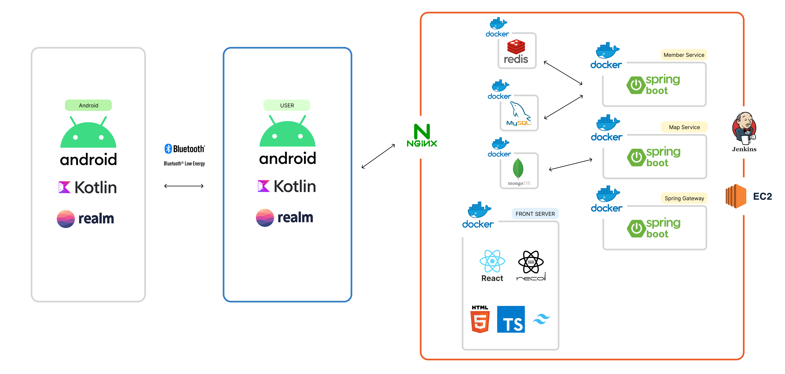

  

 

  <h1>희소식</h1> 
  
지진,전쟁과 같은 재난 상황에서 통신이 끊겼을 경우 ,

가족들과 연락 또는 주변 사람들에게 문자를 보내서 도움을 받고 싶을 때,

모스부호나 구조요청를 통해 구조 도움을 받고 싶을 때, 

저희는 이와 같은 상황을 위해 “희소식” 서비스를 고안했습니다.

 

## 👪 개발 멤버 소개

<table> <tr> 
<td height="140px" align="center"> <a href="https://github.com/rileyleee">     👑 이은경  (BackEnd)  </a>  </td>  
<td height="140px" align="center"> <a href="https://github.com/kimnayeon16">     😶 김나연  (FrontEnd) </a>  </td> 
<td height="140px" align="center"> <a href="https://github.com/Kim-Yejinn">     🙄 김예진  (BackEnd)  </a>  </td> 
<td height="140px" align="center"> <a href="https://github.com/seondy">     😆 선다영  (FrontEnd) </a>  </td>
<td height="140px" align="center"> <a href="https://github.com/sseq007">     😁 신준호  (BackEnd) </a>  </td> 
<td height="140px" align="center"> <a href="https://github.com/elle6044">     🙂 이준용  (BackEnd) </a>  </td> </tr> 
</table>

 

## 📆 프로젝트 기간

### 23.10.09. ~ 23.11.17

 

## 기술 스택

| FrontEnd                | BackEnd            | Android            | DB           | CI/CD                     | 협업툴  |
| ----------------------- | ------------------ | --------------- | ------------ | ------------------------- | ------- |
| Node 18.16.1            | Java JDK 11        | CompileSDK 34   | MySQL 8.0.33 | AWS EC2(Ubuntu 20.04 LTS) | GitLab  |
| NPM 9.6.7               | Spring Boot 2.7.17 | TargetSDK  33   | Redis 7.0.12 | Nginx 1.25.1              | Jira    |
| Typescript + TailWindCss| Gradle 8.3         | MinSDK 30       | MongoDB 7.0.2| Docker 24                 | Notion  |
| React 18.2.0            | Lombok             | Java 8          |              | Jenkins                   | figma   |
| Recoil                  | Spring Security    | Realm           |              |                           | Swagger |
| React-query             | JJWT 0.9.1         |                 |              |                           | Postman |

 

## 시스템 아키텍처

   
  
   

 

# 📚 프로젝트 기능

### 1. 메인화면

## 📝 프로젝트 산출물
- [개발환경](https://wandering-swan-9fa.notion.site/43a462ff4347423ea785941502ca333a?pvs=4)
- [요구사항 명세서](https://wandering-swan-9fa.notion.site/e83234e536a3495594dd912e9fc82147?pvs=4)
- [앱 erd](./img/app_erd.png)
- [웹 erd](./img/wep_erd.png)
- [api 연동 규격서](https://wandering-swan-9fa.notion.site/API-523be369856b4bbfb9a425ba2a324633?pvs=4)
- [포팅메뉴얼](./exec/희소식%20포팅매뉴얼.pdf)
- [발표 자료](./exec/희소식%20최종발표.pdf)
